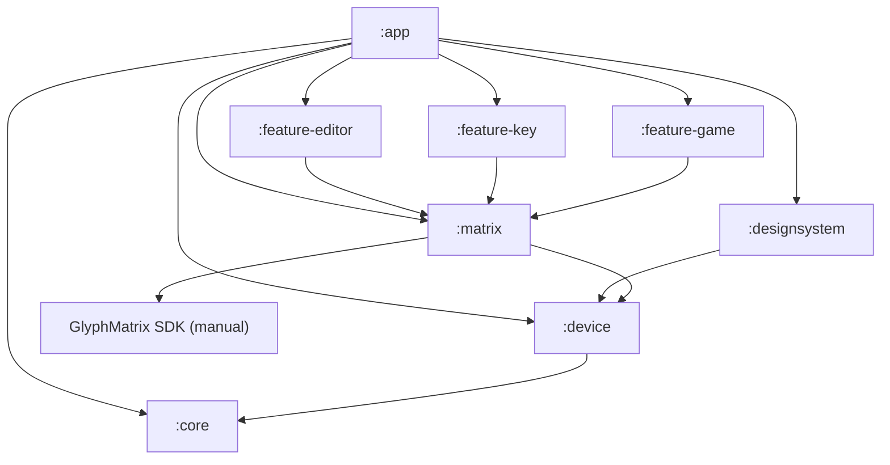

# Dot.

Приложение для Nothing Phone: рисование, AOD-тои, Essential Key и игра прямо на **Glyph-матрице**.

**[Русский](#русский)** · **[English](#english)**

---

## Скачать · Download

| | |
| --- | --- |
| **Последний APK / Latest APK** | **[v0.1.0 — скачать · download](https://github.com/kavastore/nothing-dot/releases/download/v0.1.0/dot-0.1.0.apk)** (~34 MB) |
| Все версии / All releases | [github.com/kavastore/nothing-dot/releases](https://github.com/kavastore/nothing-dot/releases) |
| Исходники / Source | `git clone https://github.com/kavastore/nothing-dot.git` |

> Репозиторий публичный — APK качается без аккаунта GitHub.  
> The repo is public — no GitHub account needed to download the APK.

---

## Русский

<a id="русский"></a>

### Меню

1. [Скачать APK](#скачать--download)
2. [Быстрый старт](#быстрый-старт)
3. [Что умеет](#что-умеет)
4. [Поддерживаемые устройства](#поддерживаемые-устройства)
5. [Сборка из исходников](#сборка-из-исходников)
6. [Архитектура](#архитектура)
7. [English](#english)

### Быстрый старт

1. Скачайте **[dot-0.1.0.apk](https://github.com/kavastore/nothing-dot/releases/download/v0.1.0/dot-0.1.0.apk)**.
2. На телефоне разрешите установку из неизвестных источников (для браузера или «Файлов»).
3. Откройте APK и установите.
4. При первом запуске — короткий онбординг, затем главный экран с плитками **PLAY / DRAW / KEY / IMG**.

**На Nothing Phone:** на главном появится **LIVE DEMO** — рисунок сразу уходит на заднюю матрицу. Статус `MATRIX OK` означает, что матрица доступна.

### Что умеет

| Модуль | Описание |
| --- | --- |
| **DRAW** — Pixel Editor | Перо, ластик, заливка, пипетка; яркость 0–255; трансформы; кадры анимации; LIVE на матрице; виджет быстрого рисунка |
| **AOD Glyph Toy** | Рисунок или анимация в Always-on Display |
| **IMG** — Картинка → матрица | Импорт фото, downscale + дизеринг Флойда-Стейнберга; AOD или показ по Essential Key |
| **KEY** — Essential Key | Двойной/тройной/долгий тап → фонарик, камера, скриншот, беззвучный режим; освобождение кнопки через Shizuku / беспроводной ADB / ADB с ПК |
| **PLAY** — Arkanoid | Игра на матрице Phone (3): наклон — платформа, Glyph-кнопка — шар и выстрел |

### Поддерживаемые устройства

| Устройство | Матрица | Особенности |
| --- | --- | --- |
| Nothing Phone (4a) Pro | 13×13 | LIVE, AOD, KEY, IMG |
| Nothing Phone (3) | 25×25 | + Glyph-кнопка, Arkanoid |

- **Платформа:** Nothing OS 4+ / Android 16, `minSdk 33`
- **applicationId:** `tech.dotlab.dot`
- На эмуляторе или другом Android 33+ редактор работает, матрица — нет (статус `NONE`, это нормально)

### Сборка из исходников

**Требования:** Android Studio, Android SDK 35, JDK 17+.

**Обязательно:** проприетарный [GlyphMatrix SDK](https://github.com/Nothing-Developer-Programme/GlyphMatrix-Developer-Kit) **не в репозитории**. Скачайте AAR и положите в `matrix/libs/glyph-matrix-sdk-2.0.aar` — см. [matrix/libs/README.md](matrix/libs/README.md).

```bash
git clone https://github.com/kavastore/nothing-dot.git
cd nothing-dot
# положите AAR в matrix/libs/
./gradlew :app:assembleDebug   # или assembleRelease
./gradlew test
```

**Стек:** Kotlin 2.0.21 · Jetpack Compose · Room · DataStore · Shizuku · libadb-android · GlyphMatrix SDK 2.0 · AGP 8.13.2 · Gradle 8.13.

### Архитектура



| Модуль | Назначение |
| --- | --- |
| `:core` | `LogicalFrame`, `ToyType`, `Gesture`, `KeyAction` |
| `:device` | Профили устройств, `ShapeMask`, детект модели |
| `:matrix` | Рендер на матрицу через GlyphMatrix SDK |
| `:designsystem` | Тема Nothing, `DotMatrixPreview` / `DotMatrixCanvas` |
| `:feature-editor` | Pixel Editor, Room, AOD-той |
| `:feature-key` | Essential Key Remapper |
| `:feature-game` | Arkanoid + `ArkanoidToyService` |
| `:app` | Онбординг, навигация, главный экран |

---

## English

<a id="english"></a>

### Contents

1. [Download APK](#скачать--download)
2. [Quick start](#quick-start)
3. [Features](#features)
4. [Supported devices](#supported-devices)
5. [Build from source](#build-from-source)
6. [Architecture](#architecture-en)
7. [Русский](#русский)

### Quick start

1. Download **[dot-0.1.0.apk](https://github.com/kavastore/nothing-dot/releases/download/v0.1.0/dot-0.1.0.apk)**.
2. Allow installs from unknown sources on your phone.
3. Open the APK and install.
4. First launch shows a short onboarding, then the home screen with **PLAY / DRAW / KEY / IMG** tiles.

**On a Nothing Phone:** the home screen **LIVE DEMO** mirrors your drawing to the rear matrix. Status `MATRIX OK` means the matrix is available.

### Features

| Module | Description |
| --- | --- |
| **DRAW** — Pixel Editor | Pen, eraser, fill, eyedropper; brightness 0–255; transforms; animation frames; LIVE matrix preview; quick-draw widget |
| **AOD Glyph Toy** | Art or animation in Always-on Display |
| **IMG** — Image → matrix | Photo import, downscale + Floyd–Steinberg dithering; AOD or Essential Key trigger |
| **KEY** — Essential Key | Double/triple/long tap → torch, camera, screenshot, silent mode; full unlock via Shizuku / wireless ADB / desktop ADB |
| **PLAY** — Arkanoid | Matrix game on Phone (3): tilt for paddle, Glyph Button for ball and fire |

### Supported devices

| Device | Matrix | Notes |
| --- | --- | --- |
| Nothing Phone (4a) Pro | 13×13 | LIVE, AOD, KEY, IMG |
| Nothing Phone (3) | 25×25 | + Glyph Button, Arkanoid |

- **Platform:** Nothing OS 4+ / Android 16, `minSdk 33`
- **applicationId:** `tech.dotlab.dot`
- On emulator or non-Nothing Android 33+, the editor works; matrix stays unavailable (`NONE`)

### Build from source

**Requirements:** Android Studio, Android SDK 35, JDK 17+.

**Required:** the proprietary [GlyphMatrix SDK](https://github.com/Nothing-Developer-Programme/GlyphMatrix-Developer-Kit) is **not in this repo**. Download the AAR to `matrix/libs/glyph-matrix-sdk-2.0.aar` — see [matrix/libs/README.md](matrix/libs/README.md).

```bash
git clone https://github.com/kavastore/nothing-dot.git
cd nothing-dot
# place AAR in matrix/libs/
./gradlew :app:assembleDebug   # or assembleRelease
./gradlew test
```

**Stack:** Kotlin 2.0.21 · Jetpack Compose · Room · DataStore · Shizuku · libadb-android · GlyphMatrix SDK 2.0 · AGP 8.13.2 · Gradle 8.13.

### Architecture

<a id="architecture-en"></a>

Same module layout as above — see the [Russian architecture section](#архитектура) for the diagram and module table.
