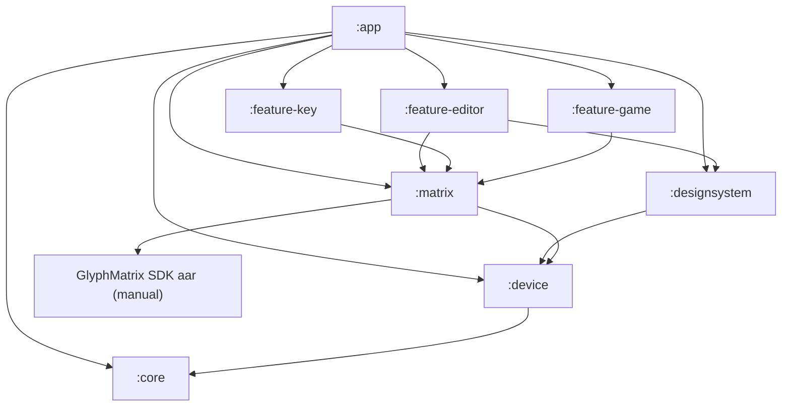

# Dot.

**Русский** · [English](#english)

---

## Русский

Приложение для Nothing Phone, превращающее заднюю **Glyph-матрицу** в холст: пиксельный
редактор, анимации, AOD-тои, игра и переназначение Essential Key.

- **Устройства:** Nothing Phone (4a) Pro (`DEVICE_25111p`) и Nothing Phone (3) (`DEVICE_23112`, матрица 25×25 + Glyph-кнопка)
- **Платформа:** Nothing OS 4.1 / Android 16, `minSdk 33`
- **applicationId / namespace:** `tech.dotlab.dot`

### Возможности

- **Pixel Editor** — рисование по сетке матрицы (перо/ластик/заливка/пипетка), яркость 0–255, трансформы, кадры анимации, LIVE-превью на матрице.
- **AOD Glyph Toy** — показ рисунка/анимации в Always-on (`PixelArtToyService`).
- **Картинка → матрица** — импорт фото через Photo Picker, downscale + дизеринг Флойда-Стейнберга.
- **Essential Key Remapper** — мульти-тапы (DOUBLE/TRIPLE/LONG_PRESS) на действия (фонарик, камера, скриншот, беззвучный режим). Полное освобождение кнопки через Shizuku / встроенный беспроводной ADB / ADB с ПК.
- **Arkanoid на матрице** — игра на задней матрице: наклон (акселерометр) двигает платформу, Glyph-кнопка запускает шар и стреляет.

### Стек

Kotlin 2.0.21 · Jetpack Compose · Room · DataStore · Shizuku-API · libadb-android · Nothing GlyphMatrix SDK 2.0 · AGP 8.13.2 · KSP · Gradle 8.13.

### Архитектура модулей


| Модуль | Назначение |
| --- | --- |
| `:core` | Модели: `LogicalFrame`, `ToyType`, `Gesture`, `UnlockMethod`, `KeyAction`. |
| `:device` | Профили устройств (`DeviceProfile`, `DeviceRegistry`), `ShapeMask`, определение текущего устройства. |
| `:matrix` | Рендер `LogicalFrame` на матрицу через GlyphMatrix SDK + база `GlyphToyService`; fallback без железа. |
| `:designsystem` | Тема Nothing (монохром + красный акцент), `DotMatrixPreview` / `DotMatrixCanvas`. |
| `:feature-editor` | Pixel Editor: Room-хранилище, движок (`ImageImport`, `PngExport`), AOD-той, UI. |
| `:feature-key` | Essential Key Remapper: DataStore, `ActionRegistry`, Accessibility-сервис, мастера разблокировки. |
| `:feature-game` | Arkanoid (чистый Kotlin + JVM-тесты) и `ArkanoidToyService`. |
| `:app` | Склейка: онбординг, навигация, главный экран, демо на матрице. |

### Требования

- Android Studio с Android SDK **35**
- JDK 17+ (рекомендуется JBR 21 из Android Studio)
- Android-устройство/эмулятор с API **33+** (полный функционал матрицы — только на поддерживаемых Nothing Phone)

### Обязательный шаг: GlyphMatrix SDK

Проприетарный SDK от Nothing **не входит в репозиторий**. Перед сборкой скачайте AAR и положите его в `matrix/libs/`:

1. Откройте релизы [GlyphMatrix-Developer-Kit](https://github.com/Nothing-Developer-Programme/GlyphMatrix-Developer-Kit).
2. Скачайте последнюю версию AAR (для Phone (4a) Pro нужна версия с константой `DEVICE_25111p`).
3. Поместите его как `matrix/libs/glyph-matrix-sdk-2.0.aar`.

Подробности — в [matrix/libs/README.md](matrix/libs/README.md). Любой `*.aar` в этой папке подхватывается автоматически; держите только один файл.

> Без AAR проект не соберётся. `local.properties` (путь к Android SDK) Android Studio создаёт сам.

### Сборка и запуск

```bash
./gradlew :app:assembleDebug
./gradlew test
```

Или откройте папку в Android Studio — Gradle sync пройдёт автоматически, затем запустите конфигурацию `app`.

**Эмулятор / любой Android (API 33+):** интро → главный → DRAW → рисование, кадры, сохранение. Матрица в статусе `NONE` (нормально без железа).

**Nothing Phone (4a) Pro / (3):** на главном — блок `LIVE DEMO`, статус `MATRIX OK`; редактор в режиме LIVE; AOD-той, картинка → матрица, Essential Key.

---

## English

<a id="english"></a>

Android app for Nothing Phone that turns the rear **Glyph Matrix** into a canvas: pixel editor,
animations, AOD toys, a game, and Essential Key remapping.

- **Devices:** Nothing Phone (4a) Pro (`DEVICE_25111p`) and Nothing Phone (3) (`DEVICE_23112`, 25×25 matrix + Glyph Button)
- **Platform:** Nothing OS 4.1 / Android 16, `minSdk 33`
- **applicationId / namespace:** `tech.dotlab.dot`

### Features

- **Pixel Editor** — draw on the matrix grid (pen/eraser/fill/eyedropper), brightness 0–255, transforms, animation frames, LIVE preview on the physical matrix.
- **AOD Glyph Toy** — show art/animation in Always-on (`PixelArtToyService`).
- **Image → matrix** — import photos via Photo Picker, downscale + Floyd–Steinberg dithering.
- **Essential Key Remapper** — multi-tap gestures (DOUBLE/TRIPLE/LONG_PRESS) mapped to actions (torch, camera, screenshot, silent mode). Full key unlock via Shizuku / in-app wireless ADB / desktop ADB.
- **Matrix Arkanoid** — game rendered on the rear matrix: tilt (accelerometer) moves the paddle, Glyph Button launches the ball and fires.

### Stack

Kotlin 2.0.21 · Jetpack Compose · Room · DataStore · Shizuku-API · libadb-android · Nothing GlyphMatrix SDK 2.0 · AGP 8.13.2 · KSP · Gradle 8.13.

### Module architecture



| Module | Purpose |
| --- | --- |
| `:core` | Domain models: `LogicalFrame`, `ToyType`, `Gesture`, `UnlockMethod`, `KeyAction`. |
| `:device` | Device profiles (`DeviceProfile`, `DeviceRegistry`), `ShapeMask`, current device resolution. |
| `:matrix` | Renders `LogicalFrame` to the matrix via GlyphMatrix SDK + `GlyphToyService` base; no-hardware fallback. |
| `:designsystem` | Nothing theme (monochrome + red accent), `DotMatrixPreview` / `DotMatrixCanvas`. |
| `:feature-editor` | Pixel Editor: Room storage, engine (`ImageImport`, `PngExport`), AOD toy, UI. |
| `:feature-key` | Essential Key Remapper: DataStore, `ActionRegistry`, Accessibility service, unlock wizards. |
| `:feature-game` | Arkanoid (pure Kotlin + JVM tests) and `ArkanoidToyService`. |
| `:app` | Shell: onboarding, navigation, home screen, matrix demo. |

### Requirements

- Android Studio with Android SDK **35**
- JDK 17+ (JBR 21 from Android Studio recommended)
- Android device/emulator with API **33+** (full matrix features require a supported Nothing Phone)

### Required: GlyphMatrix SDK

Nothing's proprietary SDK is **not included** in this repository. Before building, download the AAR and place it in `matrix/libs/`:

1. Open [GlyphMatrix-Developer-Kit releases](https://github.com/Nothing-Developer-Programme/GlyphMatrix-Developer-Kit).
2. Download the latest AAR (Phone (4a) Pro requires a build with the `DEVICE_25111p` constant).
3. Save it as `matrix/libs/glyph-matrix-sdk-2.0.aar`.

See [matrix/libs/README.md](matrix/libs/README.md) for details. Any `*.aar` in that folder is picked up automatically; keep only one file.

> The project will not build without the AAR. Android Studio creates `local.properties` (SDK path) automatically.

### Build and run

```bash
./gradlew :app:assembleDebug
./gradlew test
```

Or open the folder in Android Studio — Gradle sync runs automatically, then launch the `app` configuration.

**Emulator / any Android (API 33+):** intro → home → DRAW → draw, frames, save. Matrix status shows `NONE` (expected without hardware).

**Nothing Phone (4a) Pro / (3):** home screen `LIVE DEMO`, status `MATRIX OK`; editor LIVE mode; AOD toy, image → matrix, Essential Key.
